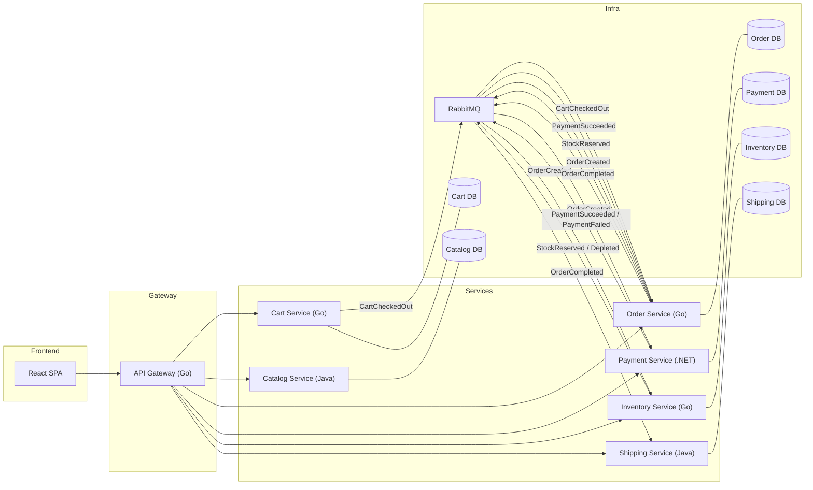
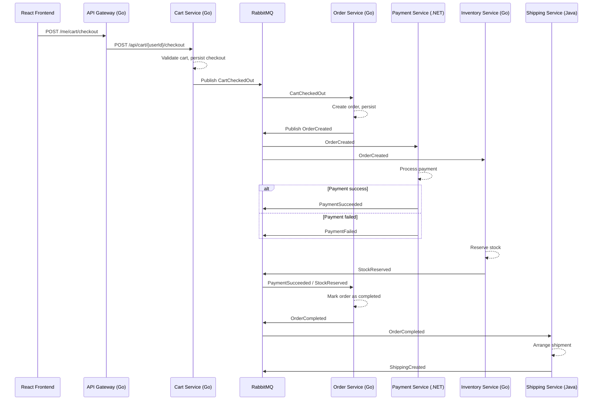
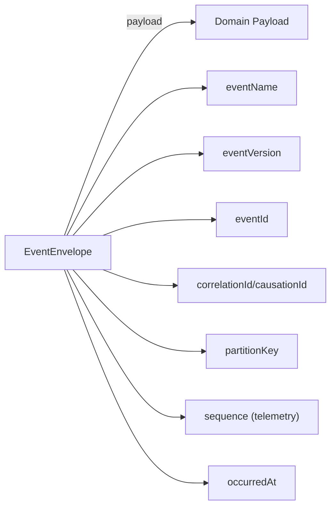
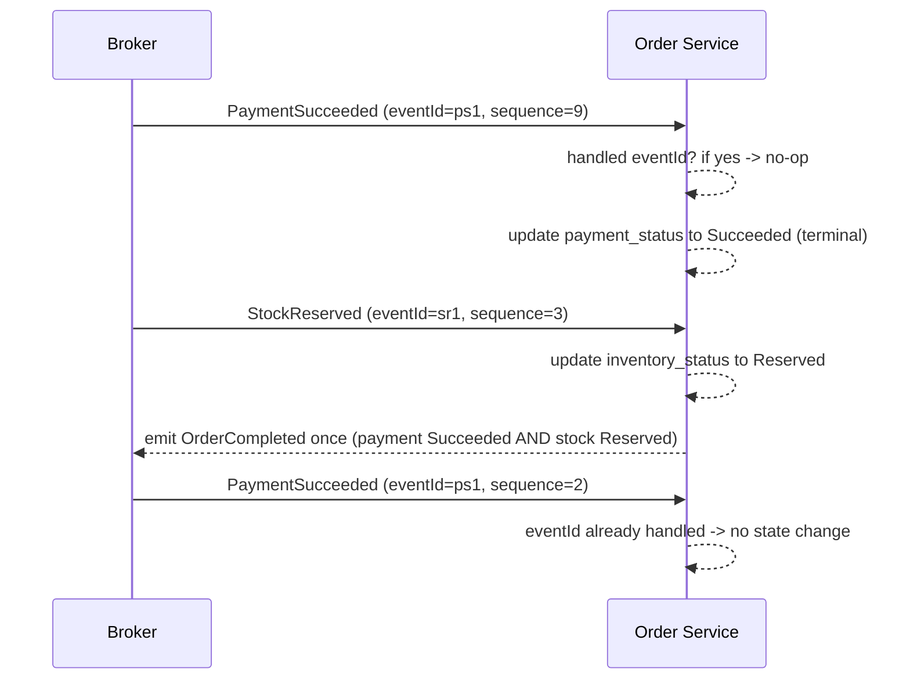

# Architecture Overview

This document describes the high-level architecture of the polyglot, event‑driven e‑commerce system. It includes the system diagram, event flows, service responsibilities, and example event contracts.

---

## System Diagram



---

## Checkout Flow (Sequence Diagram)



> Note: When inventory cannot fully reserve stock it publishes `StockDepleted`; there is
> no consumer for that event yet.

---

## Event Contracts & Versioning (Option A)
- Canonical JSON Schemas live in `contracts/`.
- Envelope metadata: `eventName`, `eventVersion`, `eventId`, `correlationId`, `causationId`, `producer`, `partitionKey`, `occurredAt`, optional `sequence` (telemetry only), and `payload`.
- Payloads carry domain data only (no transport metadata).
- Versioning: additive changes stay within the same major version; breaking changes require a new `eventVersion` with new schema files. Older versions remain available.
- Option A (current): correctness via idempotency + domain invariants; ordering is not required. Option B (future): ordering with buffering.

### Idempotency layers
- Transport: `eventId` is globally unique; handlers must be safe on duplicates.
- Domain: uniqueness constraints (one order per cart, one reservation per order, one shipment per order) and sticky state machines prevent duplicate side effects even if events arrive late/out-of-order.

### Correlation example (no ordering reliance)
- `CartCheckedOut` seeds `correlationId`.
- `OrderCreated` copies `correlationId`, sets `causationId` to the cart checkout.
- `PaymentSucceeded` / `PaymentFailed` and `StockReserved` propagate `correlationId`, reference `OrderCreated` via `causationId`.
- `OrderCompleted` fires once when payment succeeded **and** stock reserved, regardless of arrival order.
- `ShippingCreated` keeps the same `correlationId`.

### Using Option A safely
- Do not assume ordered delivery; treat `sequence` as observability only.
- Prefer “set state” over “apply delta.”
- Make final states terminal (e.g., payment succeeded/failed).
- Expect duplicates and late arrivals; guard with `eventId` and domain uniqueness.

### Diagrams

#### Envelope + payload composition


#### Ordering-independent dedup/idempotency


---

## Service Responsibilities

### Cart Service (Go)
- Manages user carts.
- Exposes REST endpoints to add/update items and checkout.
- Publishes **CartCheckedOut** when checkout occurs.

### Order Service (Go)
- Listens to **CartCheckedOut**.
- Creates orders and persists state.
- Publishes **OrderCreated** and **OrderCompleted**.

### Payment Service (.NET)
- Listens to **OrderCreated**.
- Simulates payment processing.
- Publishes **PaymentSucceeded** or **PaymentFailed**.

### Inventory Service (Go)
- Listens to **OrderCreated**.
- Reserves stock.
- Publishes **StockReserved** or **StockDepleted** (no consumer yet for **StockDepleted**).

### Shipping Service (Java)
- Listens to **OrderCompleted**.
- Simulates shipment label creation.
- Publishes **ShippingCreated**.

### Catalog Service (Java)
- Provides product catalog CRUD for the gateway.
- Exposes `/api/catalog/products` and `/api/catalog/health`.

---

## Event Contracts (Examples)

### CartCheckedOut
```json
{
  "eventName": "CartCheckedOut",
  "eventVersion": 1,
  "eventId": "7c9c2aa9-3df6-4b92-8c45-3c6da0d4b1ad",
  "correlationId": "4d9e3b13-4c72-4af5-a4a0-1d5d0c11aa71",
  "producer": "cart-service",
  "partitionKey": "c123",
  "sequence": 12,
  "occurredAt": "2025-01-01T12:00:00Z",
  "schema": "contracts/events/cart/CartCheckedOut.v1.enveloped.schema.json",
  "payload": {
    "cartId": "c123",
    "userId": "u42",
    "items": [
      { "productId": "p1", "quantity": 2, "price": 100.0 }
    ],
    "totalAmount": 200.0,
    "timestamp": "2025-01-01T12:00:00Z"
  }
}
```
