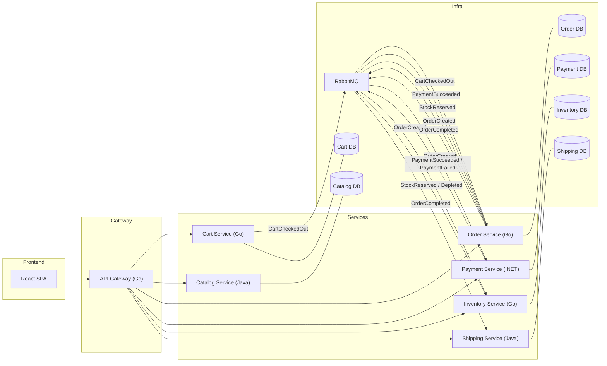
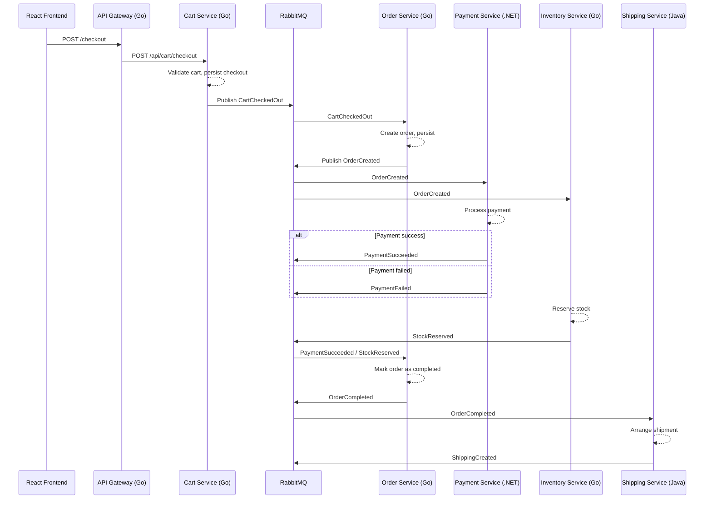

# Architecture Overview

This document describes the high-level architecture of the polyglot, event‑driven e‑commerce system. It includes the system diagram, event flows, service responsibilities, and example event contracts.

---

## System Diagram



---

## Checkout Flow (Sequence Diagram)



---

## Service Responsibilities

### Cart Service (Go)
- Manages user carts.
- Exposes REST endpoints to add/remove items.
- Publishes **CartCheckedOut** when checkout occurs.

### Order Service (Go)
- Listens to **CartCheckedOut**.
- Creates orders and persists state.
- Publishes **OrderCreated** and **OrderCompleted**.

### Payment Service (.NET)
- Listens to **OrderCreated**.
- Simulates payment processing.
- Publishes **PaymentSucceeded** or **PaymentFailed**.

### Inventory Service (Go)
- Listens to **OrderCreated**.
- Reserves stock.
- Publishes **StockReserved**.

### Shipping Service (Java)
- Listens to **OrderCompleted**.
- Simulates shipment label creation.
- Publishes **ShippingCreated**.

---

## Event Contracts (Examples)

### CartCheckedOut
```json
{
  "eventType": "CartCheckedOut",
  "cartId": "c123",
  "userId": "u42",
  "items": [
    { "productId": "p1", "quantity": 2, "price": 100.0 }
  ],
  "totalAmount": 200.0,
  "timestamp": "2025-01-01T12:00:00Z"
}
```


