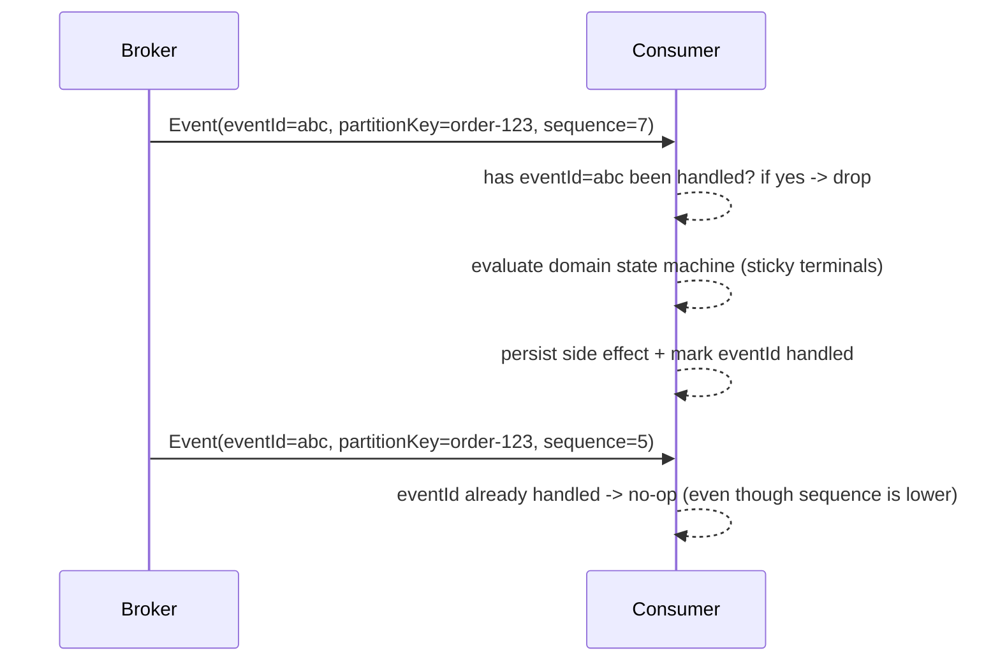

# Event Contracts (Option A: idempotency without ordering)

RabbitMQ provides at-least-once delivery with no ordering guarantees. This design uses **idempotency + domain invariants** to stay correct even when events are duplicated or arrive out of order. The envelope keeps `sequence` for observability, but **ordering is never a correctness prerequisite**.

## Event Contracts & Versioning
- **Purpose:** Canonical JSON Schemas for envelopes and payloads shared across services.
- **Envelope fields (authoritative metadata):** `eventName`, `eventVersion`, `eventId`, `correlationId`, `causationId`, `producer`, `partitionKey`, `occurredAt`, `schema`, `payload`.
- **Sequence field:** Optional, best-effort publisher metadata; consumers must not reject or prefer events based on `sequence`.
- **Payload rules:** Domain data only—no `eventType`, no transport metadata.
- **Versioning rules:** Schemas are immutable once published. Additive changes stay in the same major version; breaking changes require a new `eventVersion` and new files (e.g., `OrderCreated.v2.*`). Older versions remain available so consumers can upgrade independently.

### Current implementation notes
- `order-service-go` populates `schema` with the payload schema path (for example `contracts/events/order/OrderCreated.v1.payload.schema.json`).
- `cart-service-go` and `inventory-service-go` currently set `schema` to the **enveloped** schema path instead of the payload schema path.
- `payment-service-dotnet` publishes `PaymentSucceeded` / `PaymentFailed` with `schema=null` and `sequence=null`.

Consumers should treat `schema` and `sequence` as advisory until the implementations are aligned with the canonical envelope contract.

### Envelope example (OrderCreated v1)
```json
{
  "eventName": "OrderCreated",
  "eventVersion": 1,
  "eventId": "f79c138b-4250-4ce3-82ab-bd9f4bc1f7de",
  "correlationId": "b5c1d8dd-5b86-4fde-9c8e-4f7a9c5c0bba",
  "producer": "order-service",
  "partitionKey": "6b5ab234-5cbe-4d1c-8d0d-8c3671f0d4f2",
  "sequence": 4,
  "occurredAt": "2024-05-01T12:35:10Z",
  "schema": "contracts/events/order/OrderCreated.v1.payload.schema.json",
  "payload": {
    "orderId": "6b5ab234-5cbe-4d1c-8d0d-8c3671f0d4f2",
    "cartId": "7d8e9f10-1112-1314-1516-171819202122",
    "userId": "1a2b3c4d-5e6f-7081-920a-bc0d1e2f3a4b",
    "items": [
      { "productId": "9a8b7c6d-5e4f-3a2b-1c0d-9e8f7a6b5c4d", "quantity": 2, "price": 49.99 }
    ],
    "totalAmount": 99.98,
    "timestamp": "2024-05-01T12:35:10Z"
  }
}
```

### Option A vs Option B (future)
- **Option A (current):** Idempotency + domain invariants; sequence is non-authoritative, no buffering, correctness is ordering-independent.
- **Option B (future/out-of-scope):** Strict ordering with buffering and re-sequencing before handling.

## Idempotency: two layers
1. **Transport-level:** `eventId` is globally unique. Handlers must be idempotent so duplicate deliveries of the same `eventId` cause no extra side effects.
2. **Domain-level:** Each service applies uniqueness rules and state machines so repeated/late events cannot violate invariants.

## State machines (ordering-independent)

### Order Service
- Fields: `payment_status` (Pending | Succeeded | Failed), `inventory_status` (Pending | Reserved | Depleted), `order_status` (Created | Completed | Failed)
- Transitions:
  - PaymentSucceeded: Pending → Succeeded; Failed → NO-OP
  - PaymentFailed: Pending → Failed; Succeeded → NO-OP
  - StockReserved: Pending → Reserved
  - OrderCompleted: emit once when `payment_status == Succeeded` **and** `inventory_status == Reserved`
- Arrival order of events must not change correctness.

### Payment Service
- Pending → Succeeded
- Pending → Failed
- Final states are terminal; late or duplicate events do not change terminal state.

### Inventory Service
- One reservation per order.
- Reservation either exists or not; duplicate reservations are invalid.
- Late duplicates should be treated as idempotent confirmation, not a second reservation.

### Shipping Service
- Exactly one shipment per order.
- Duplicate OrderCompleted events must not create multiple shipments.

## Uniqueness & required invariants (conceptual; enforce later via DB)
- Order: one order per `cartId`.
- Payment: one payment/attempt per `orderId`.
- Inventory: one reservation per `orderId`.
- Shipping: one shipment per `orderId`.
These invariants replace any reliance on message ordering for correctness.

## Exactly-once vs at-least-once: why dedup is required
- RabbitMQ provides at-least-once delivery. Duplicates and reordering are expected.
- Correctness relies on:
  - Idempotent handlers keyed by `eventId`.
  - Sticky state machines with terminal states.
  - Domain uniqueness constraints (order/reservation/payment/shipment per id).
- `sequence` can be logged/observed but is not used to accept/reject messages.

## Correlation flow
- `CartCheckedOut` sets `correlationId` for the checkout flow.
- `OrderCreated` copies `correlationId`, sets `causationId = CartCheckedOut.eventId`.
- `PaymentSucceeded` / `PaymentFailed` and `StockReserved` propagate `correlationId`, `causationId = OrderCreated.eventId`.
- `OrderCompleted` propagates the same `correlationId`; `causationId` references the immediate trigger (payment/stock outcome).
- `ShippingCreated` keeps the same `correlationId` to trace the lifecycle.

## Diagrams

### Envelope + payload composition
```mermaid
flowchart LR
    A[EventEnvelope] -->|payload| B[Domain Payload]
    A --> C[eventName]
    A --> D[eventVersion]
    A --> E[eventId]
    A --> F[correlationId/causationId]
    A --> G[partitionKey]
    A --> H[sequence (observability only)]
    A --> I[occurredAt]
```

### Dedup/idempotency flow (ordering-independent)


## Validating against schemas locally
Use any JSON Schema validator (draft 2020-12). Example with Python:
```bash
pip install jsonschema
python - <<'PY'
import json, pathlib
from jsonschema import validate

base = pathlib.Path("contracts")
schema = json.loads((base / "events/envelope/EventEnvelope.v1.schema.json").read_text())
message = json.loads((base / "examples/order/OrderCreated.v1.json").read_text())
validate(instance=message, schema=schema)
print("Message is valid")
PY
```

## Using Option A Safely (No Ordering Guarantees)
- Never assume events arrive in order; treat `sequence` as telemetry.
- Never decrement/increment blindly; prefer setting target state.
- Make final states sticky and terminal.
- Expect duplicate publishes and late arrivals; guard with `eventId` and domain uniqueness.
- Prefer “set state” over “apply delta” to stay safe under replays.
